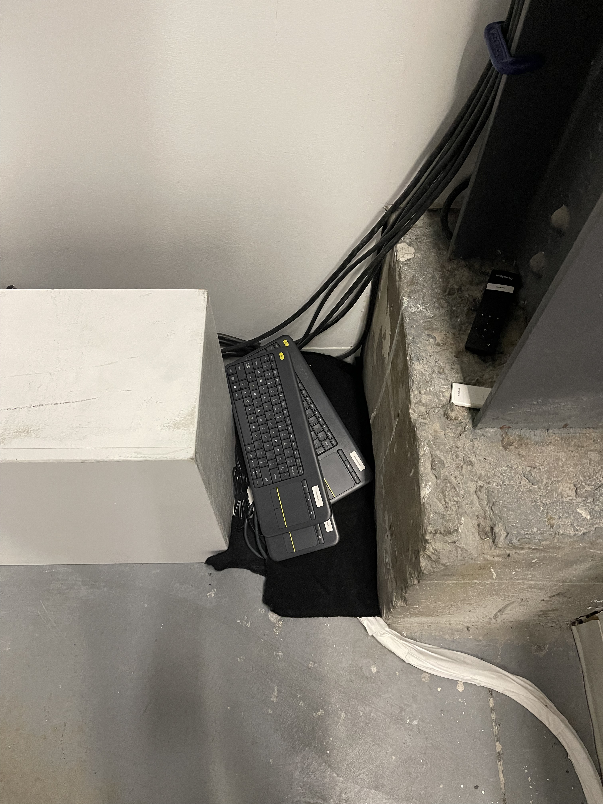

# Assemblée enchevêtrée

Assemblée enchevêtrée est une oeuvre de l’artiste Mexicain Rafael Lozano-Hemmer, résidant à Montréal (Québec, Canada).

L’oeuvre à vu le jour en 2015 dans la Bitforms gallery (New-york,États-Unis), une galerie consacrée aux nouvelles pratiques des arts médiathiques.

L'oeuvre s'est installée à Montréal durant une période de 3 mois, de août à octobre 2017, lors de l'édition de KM³, décrit comme une promenade d'arts dans les rues du quartier du spectacle".

Oeuvre de Rafael Lozano-Hemmer, Assemblée encheêvtrée.

Il s'agit d'une oeuvre intérractif puisque le visiteur est invité à participer avec l'oeuvre.
# Date de visite 
9 février 2022, Arsenal art contemporain, 2020 Rue William, Montréal, QC H3J 1R8 (Montréal, Québec).

5e édition de la Biennale internationale d'art numérique (BIAN)

# Description de l'oeuvre 
selon le cartel du musée, l'oeuvre est décrite comme :

Cette oeuvre est un appareil qui utilise un logiciel de détection
faciale afin de produire un portrait composite en temps réel.

En superposant le portrait des participants ce logiciel crée des
portraits hybrides et déstabilisants. 

Les technologies de
reconnaissance faciale sont souvent utilises par des instances
comme la police, l armee ou les entreprises pour rechercher et
cibler certaines personnes. 

Dans cette oeuvre, Rafael Lozano-
Hemmer se détourne de l'utilisation policière de ces technologies
pour créer des « anti-portraits » qui soulignent

* *Ceci est tirée du cartel de l'oeuvre "Assemblée enchevêtréee."*

# Explications sur la mise en espace de l'oeuvre 
L’oeuvre est disposée dans une salle  d’environ 12m de long sur 5m de large.

Elle se situe au fond de la salle, installer sur un mur et entourer de 3 autres oeuvres de Rafael Lozano-Hemmer.

L’endroit où se situe l’oeuvre est un choix important car c’est l'une des premières oeuvres que le visiteur aperçoit.

Selon le site de l’artiste, l’oeuvre peut aussi être adaptée pour les espaces publics (extérieur), seuls quelques composantes techniques de l’oeuvre varie 

voici un lien vers le site de l’artiste: https://www.lozano-hemmer.com/redundant_assembly.php

.
# Liste des composantes et techniques de l'oeuvre

* ordinateur (cachés au public mais installer dans des boites en bois sur le coté gauche, chaque écran fait 76cm de large sue 1,32m de long)

* caméras numériques HD

* hub Thunderbolt (une connectique permettant de connecter plusieurs périphériques)

* code écrit en OpenFrameworks (logiciel pemettant le codage informatique de l'oeuvre)

Comparaison par rapport à un corps, Vincent fait environ 1m65.

Boite de bois contenant l'ordinateur.

Camera HD permmettant la reconnaisance des visages.

Hub USB pour connecter plusieurs périphériques.

# Éléments nécessaires pour la mise en exposition

* boite de bois 

* cache-file

* support mural écran

* néon plafond (pour éclairer le visage des gens)

Support murale permettant de maintenir les écrans. 

Néon au plafond pour éclairer le visage du visiteur.

# Expérience vécue :

Au première abord, l'oeuvre peut paraître simple mais elle permet de se poser des questions sur notre place en tant qu'individu dans l'espace public.

En effet, la question qui se pose est où est ce que notre liberté s'arrête.

la reconnaisance faciale est utilisée dans beaucoup de ville dans le monde entier notamment à Montréal.

Mais la question du droit à la vie privée se pose, où s'arrête notre vie privée, comment notre image est utilisé et dans quelle but.

De plus en faisant quelque recherche, plusieurs études montrent que cette technologie peut avoir des bias raciste et mysogyne. En effet, le National Institute of Standards and Technology (2016,États-unis) à mené une recherche  et prouvé que les algorithmes du logiciel montre une probabilité d'erreur lorqu'il est en présence d'images de femme noire, 1 pour 1000 contre 1 pour 10 000, lorsqu'il s'agit d'une femme blanche".

Ce qui m'a plu dans l'oeuvre est l'aspect simple de celle ci mais une réflections vis à vis de problème actuelle.

Personnellement, pour poussez l'expérience un peu plus loin j'aurai mis à disposition du visiteur des lunettes d'invisibilité, des lunettes qui envoye un faisceau lumineux permettant de brouiller la reconnaisance.

Diagramme sur la précision de la reconnaissance faciale.

Photo provenant du journal l'OBS montrant des lunettes anti-reconnaisance faciale.
.

# Références

site de l'artiste:
https://www.lozano-hemmer.com/

article sur les bias racistes et mysogynes:
https://www.lapresse.ca/actualites/justice-et-faits-divers/2020-06-22/reconnaissance-faciale-la-sq-pourrait-acquerir-une-technologie-controversee

article du diagrapmme sur les bias raciste et mysogynnes de la reconnaissance faciale:
https://sitn.hms.harvard.edu/flash/2020/racial-discrimination-in-face-recognition-technology/

 
