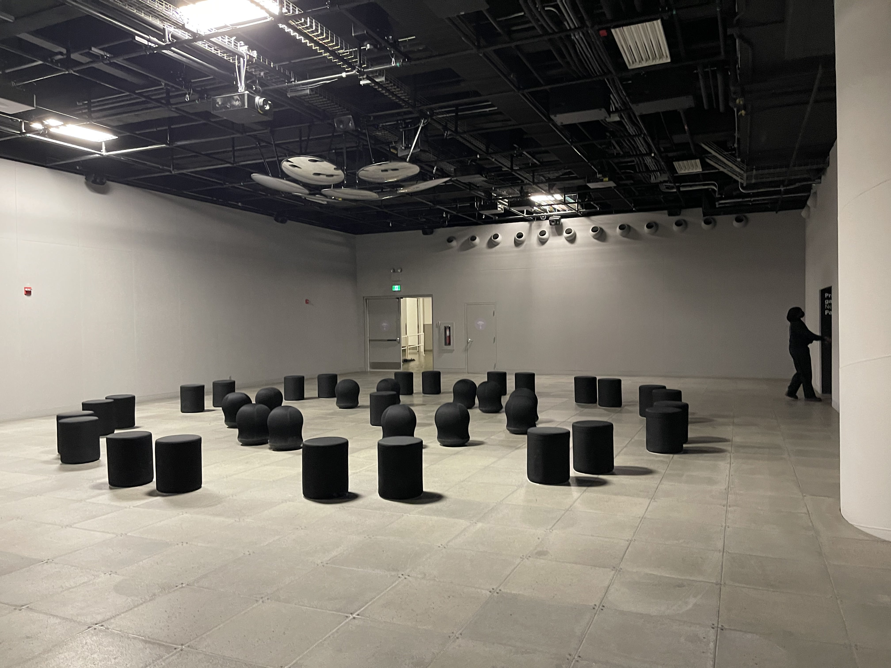
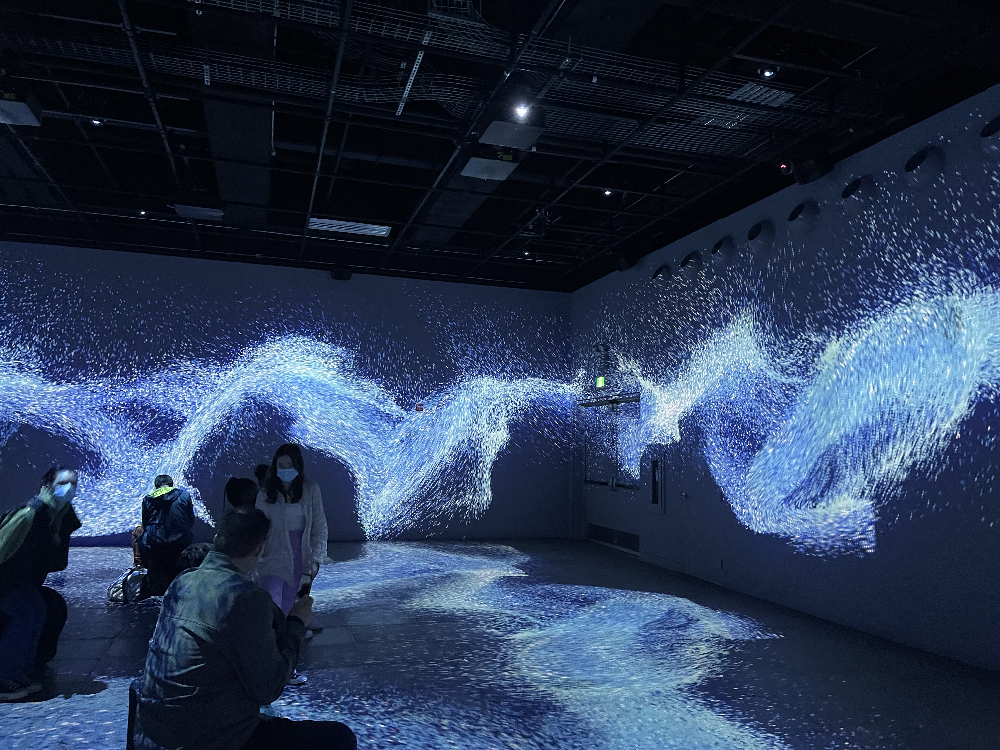

### **Horizon - Alex Le Guillou (France)** 

### Tables des matières

1. [Recharger/horizon](#Recharger-horizon)
2. [Description de l'oeuvre](#description-de-l'oeuvre)
3. [Mise en espace](#Mise-en-espace)
4. [Composantes techniques](#Composantes-techniques)
5. [Composante nécessaire de la mise en exposition](#Composante-nécessaire-de-la-mise-en-exposition)
6. [Expériences de l'utilisateur/utilisatrice](#Expériences-de-l'utilisateur-utilisatrice)
7. [Oeuvre similaire](#Oeuvre-similaire)
8. [Autres](#Autres)

Horizon est une oeuvre Immersive de l'artiste Français Alex Le Guillou résidant à Quimper (France).

Cette oeuvre à été réalisée durant l'année 2021, il s'agit d'une oeuvre audiovisuelle, c'est à dire que c'est une oeuvre possédant plusieurs médium tel que la photo, la vidéo, des images animées, du son.

Horizon est l'une des 10 oeuvres présentes au centre d'art Oasis Immersion durant l'exposition Recharger (Montréal, Québec). 

Le centre d'art Oasis Immersion se veut comme un endroit de ressourcages, de réflexion de la société via l'art immersives.

### Recharger/Horizon 

Rechager est une exposition qui est divisé dans 3 galeries, les galeries sont : 

* Portail

* Téléporteur

* Panorama

Mais recharger est une exposition qui est divisé en thème, les thèmes sont :

* La relaxation

* L'énergisation 

* reconnexion

Horizon se trouve dans la deuxième galeries, dite : Téléporteur 

et dans le thème de l'énergisation (Stimulation et energisation). 

La visiteuse/visiteur commence l'expérience par la salle d'anticipation, une salle lui expliquant le fonctionnement du musée et ses caractéristiques.

L'exposition dure 75 Minutes.

### Description de l'oeuvre 

Horizon est une oeuvre qui explore la perception de la réalité ainsi que la représentation des rêves/souvenirs.

Alex Le Guillou, voit cela entre ordre et chaos, les mouvements de particules élémentaires composent différement vision qui s'enchaînent et se mélangent pour former des paysages abstraits et des paysages naturels insipirés du ciel et de la mer. (ce texte provient du cartel d'exposition d'oasis immersion et d'Alex le Guillou).

L'oeuvre utilise beaucoup de son ainsi que de couleur tel que l'orange, le jaune, le rose et le bleu

### Mise en Espace

L'oeuvre se situe dans la galerie du téléporteur,

Il s'agit d'une oeuvre qui est projetée sur un angle de 360 degrés.

Au milieu de la salle, la visiteuse/le visiteur est invité à s'installer sur des sièges pour contempler l'oeuvre. 

Au dessus de sa tête, se trouve 7 miroir suspendu au plafond, permettant une immersion même jusqu'au plafond.

### Commposante Techniques

L'oeuvre d'Alex Le Guillou, comme celle des autres artistes présant dans l'exposition utilise le même systemes de projection.

C'est à dire : 

* Des hauts-parleurs (119)

* Des projecteur Lasers (134)

Mais pour créer cette oeuvre, l'artiste à utilisé les logiciels/médiums suivant :

* Notch (logiciel d'animation graphiques et interractive)

* After Effect (logiciel de vidéo et d'animation graphiques)

* Photographies

### Composante nécessaire de la mise en exposition

L'oeuvre ne demande pas beaucoup de moyen pour être installés,

Les seules choses qu'elle demande sont des sièges (choix de Oasis Immersion), des mirroirs (choix de Oasis Immersion), des cables de suspensions pour tenir les miroir en l'air.

Des murs blancs. 

Elle peut ainsi être projeter dans différents endroits du monde. 

### Expériences de l'utilisateur/utilisatrice 

L'expérience pour le visiteur est vraiment réussies.

En effet, l'immersion se veut total, pas une goutte de lumière passe dans la salle, ni entre les salles.

De plus chaque salle à une insonoriations vraiment bonne permettant de rester attentif à chaque détails (visuelles et sonores).

L'utilisation des couleurs mais aussi la simplicité des animations ont fait que l'oeuvre a été plaisante à regarder/analyser.

Cependant, je pense que j'aurai ajouté encore plus de miroir au plafond pour continuer le reflet qui était sur le sol.

### oeuvre similaire 

Projection dans le grand dôme à la SAT (société des arts technologiques, Montréal).

### Autres 

Le couloir de decompression permet une transition entre les galeries, il y en a 3.

Entre chaque oeuvre une transition immersive est visible, elle permet de signaler le changement d'oeuvre.

Voici d'autres photos de l'oeuvre
