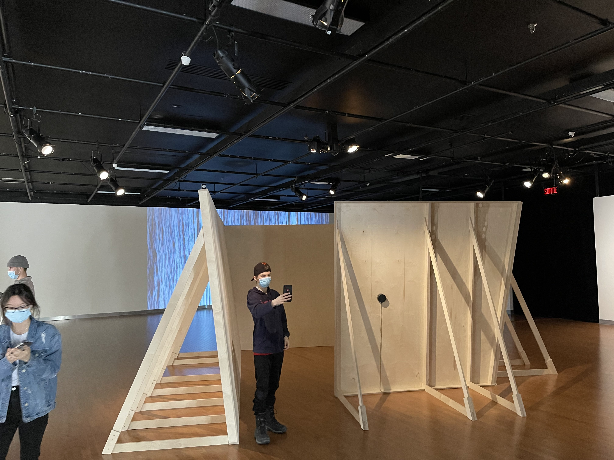
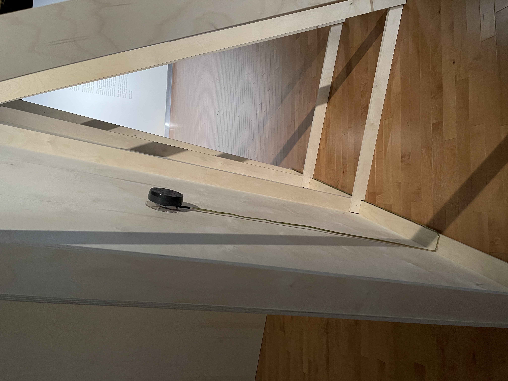
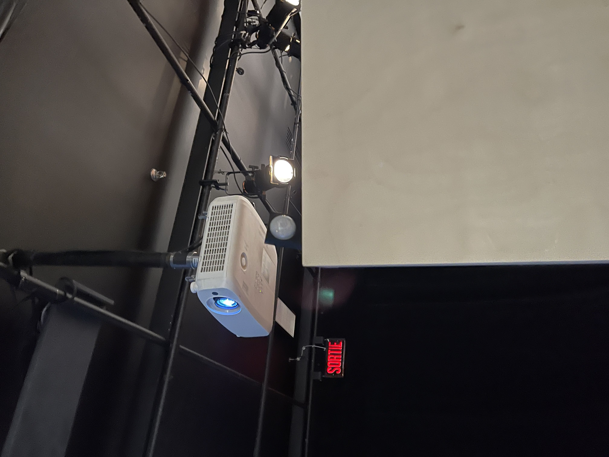

### Configuration du Sensible - Béchard Hudon

Configuration du Sensible est une exposition réalisé par Béchard Hudon et exposé à la maison des arts de Laval (Québec).

Cette exposition est tournée autours des résonnances tant sonores que physiques et sociales.

C'est une expérience qui demande est lente et calme qui permet de se questionner.

### Description de l'oeuvre 

Selon le cartel d'exposition, L'en Deçà (2021) est décrite comme une oeuvre : 

(mettre photo Cartel )

### Mise en espace 

L'oeuvre se situe au milieu de la salle Alfred Pellan, c'est l'oeuvre que le visiteur voit en premier

De par sa taille mais aussi sa matière. 

Il y 4 panneaux de contreplaqué baltique qui sont inclinés, cette ensemble de contreplaqué forme une sorte de carré.

Ces 4 panneaux sont soutenues par des pieds de bois. 

Le visiteur est invité à se placer et se déplacer dans l'esapce où bon lui semble. 

### Composante technique 

L'oeuvre est composé de 

* contreplaqué baltique

* transducteur (permettant de transformer le signal physique en un autre)

* Amplificateur 

* interface audio 

¡[amplificateur](media/photo_SAP_configuration_sensible/SAP_rangement_electronique.jpg)

* détecteurs de mouvement 

* ordinateur 

* alimatentation 

### Composante nécessaire de la mise en exposition

Les éléments nécessaires pour la mise en exposition sont des sortes de pieds soutenant les contreplaqués.

### Expériences de l'utilisateur/utilisatrice 

L'oeuvre était vraiment bien réalisé et une utilisation intérressante des sons naturelles.

J'aurais cependant mit un peu plus fort les sons pour qu'on les entendes mieux et pouvoir ainsi mieux ressentir les vibrations. 
 
