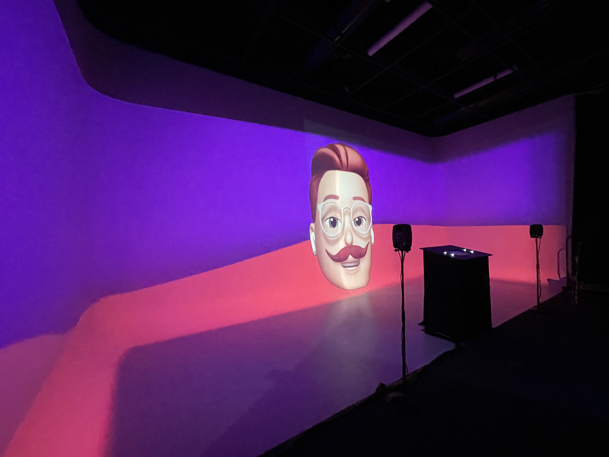
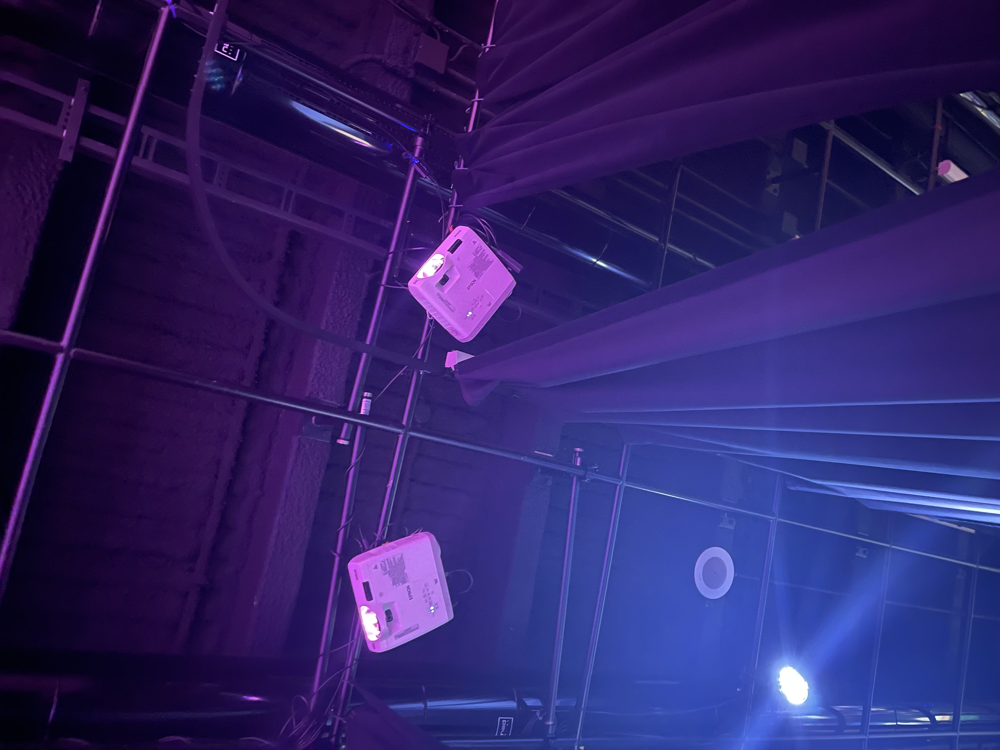
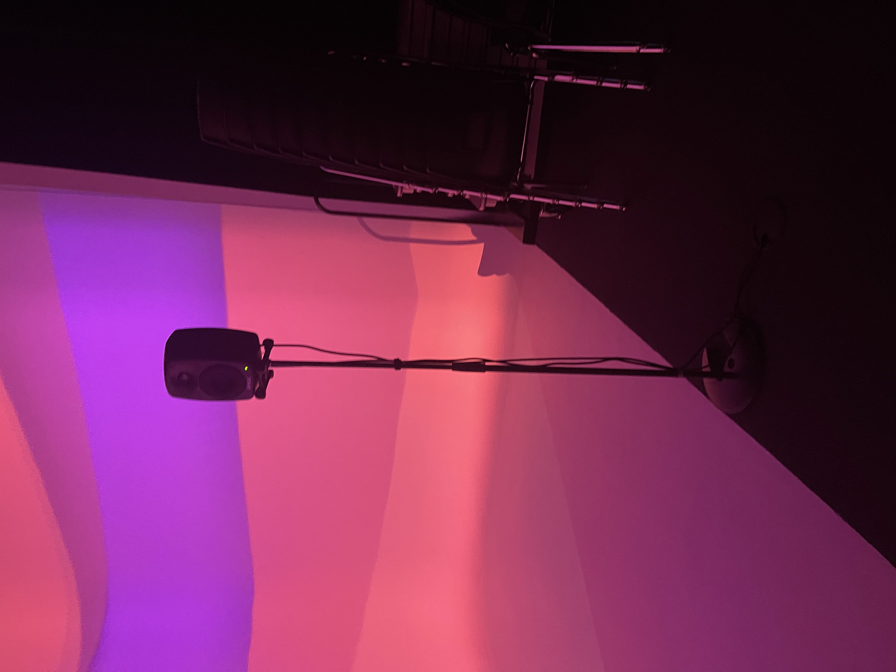
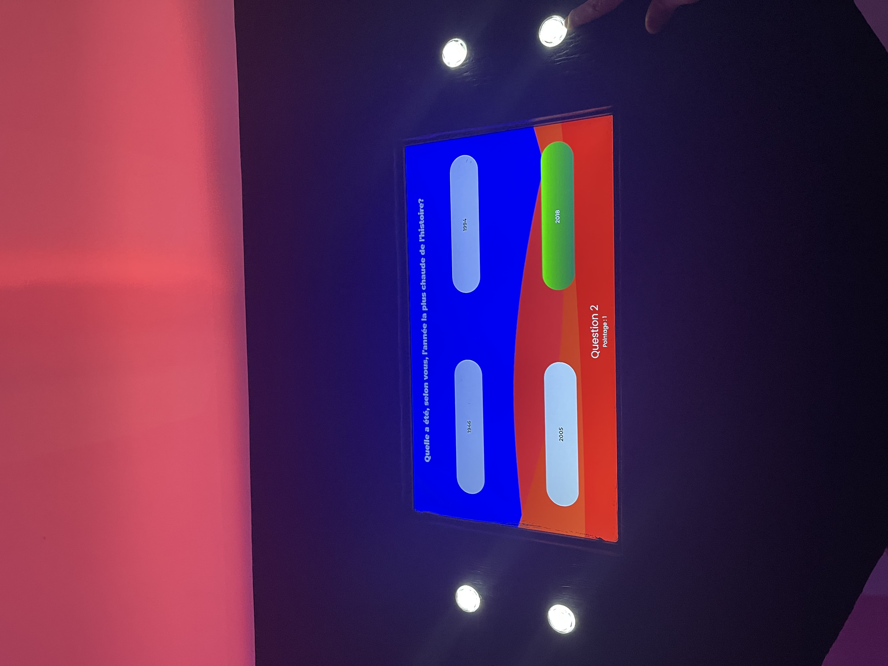
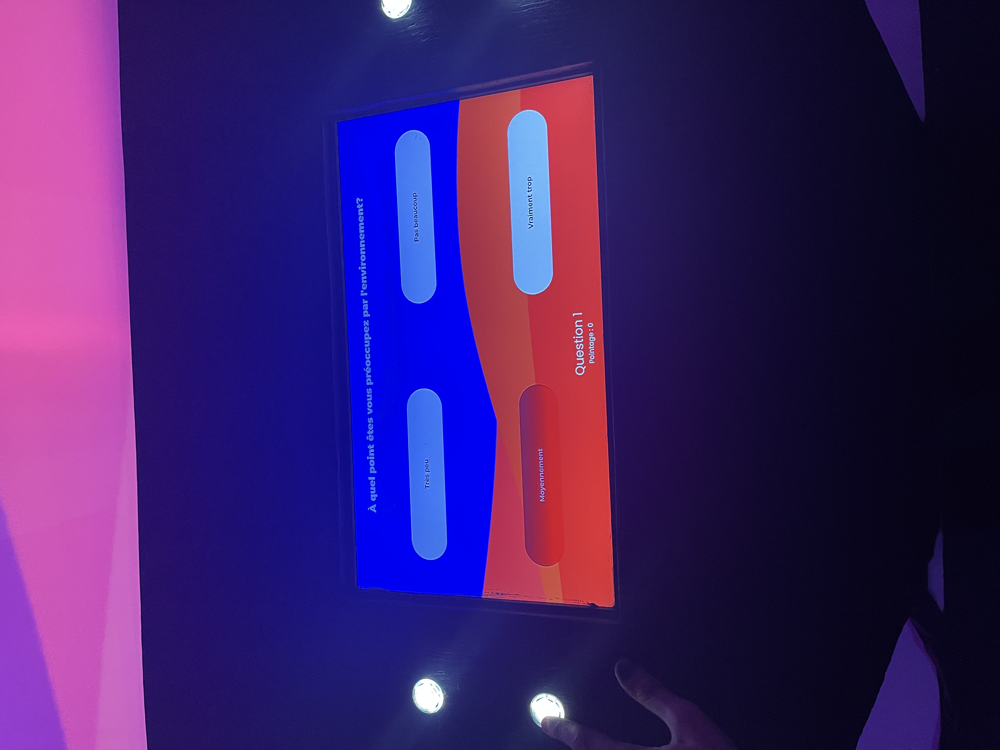
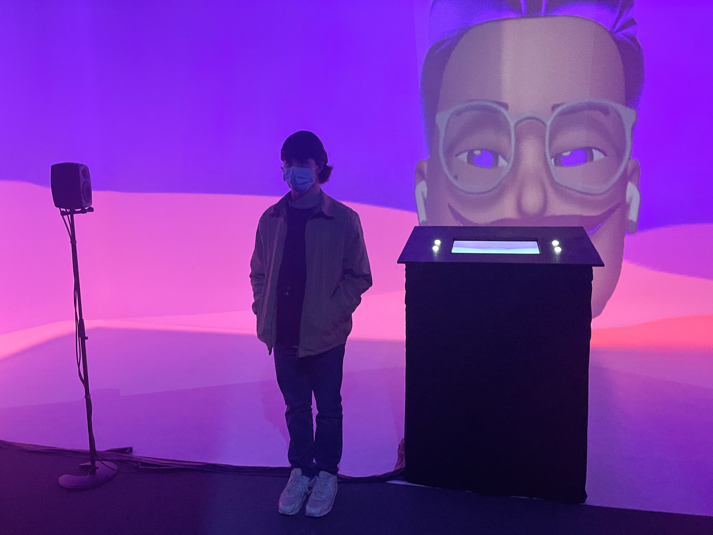

# Jeu Temporel 

Jeu Temporel est une installations créer et réaliser par les finissant de Troisième année du programme TIM (Techniques d'intégrations multimédias) Les étudiantes/étudiants ont présenter leur créations, le lundi 28 mars dans le grand Studio, dans le cégep Montmorency (Laval).

L'oeuvre est décrite comme :

Nous souhaitons sensibiliser la génération actuelle sur les conséquences écologiques de nos actions pour le futur.

Nous voulons également que notre expérience puisse faire réagir l'utilisateur sur l'importance de l'environnement et susciter son action. Une personne est invité à faire une expérience intéractive sur le sujet de l'environnement et changements climatique.

Cette personne entre dans le jeu télévisé fictif Jeu Temporel pour montrer son talent, mais le jeu s'avère être une critique du mode de vie de notre époque et d'un cri d'alarme pour le future qui s'en vient. 

Plusieurs fins différentes peuvent arriver et le joueur, et ses choix, peut réussir à vivre une fin heureuse ou désastreuse.

[Jeu-Temporelle](https://tim-montmorency.com/2022/projets/Jeu-Temporel/docs/web/index.html)

### Membres de l'équipe 

* Raphaël Fillion

* Philippe Trudel

### Le temps 
Dans cette oeuvre, le thème principale est le temps, l'interacteur va parcourir le futur sous une expérience interactive démontrant les conséquences écologiques sur le futur.

### L'ambiance
Le type d'ambiance exploité est celle d'un jeu télévisé classique où l'on retrouve des éléments ambiants énergiques tels que de la musique entrainante ainsi que des effets sonores interactifs mettant de la vie au jeu. On retrouvera également des couleurs vivantes et éclatantes donnant un aspect invitant aux joueurs avec ces effets tout droits sortis d'un animé ou des emojis d'apple.

### Mise en espace

L'oeuvre se situe dans le fond du grand studio, dans la partie du cyclorama 

Elle prends tout l'espace présent. 

### Composantes techniques

Jeu Temporelle utilise les composantes suivantes:

* Projecteurs (2)

* Haut-parleurs (2)

* ecran (pour les questions/réponses)

* bouton (pour le choix des questions/réponses)

### Composante nécessaire de la mise en exposition

L'oeuvre n'a besoin d'un seul support pour permette au visiteur de répondre aux question, il s'agit d'un pupitre 

### Expériences de l'utilisateur/utilisatrice 

Je pense que ça a été mon installations préferer car elle prenait beaucoup de taille dans l'espace situé.

De plus le choix des couleurs, des animations, des sons étaient vraiment bien réaliser.

Le choix des questions étaient très pertinentes car il s'agit de questions actuelle. 

Mon classement serait le suivant : 

* 1) Jeu temporelle

* 2) Chère Sasha

* 3) L'horloge de l'apocalypse

* 4) 3 minutes

* 5) Chronaufrage

* 6) DIstorsion Collective

